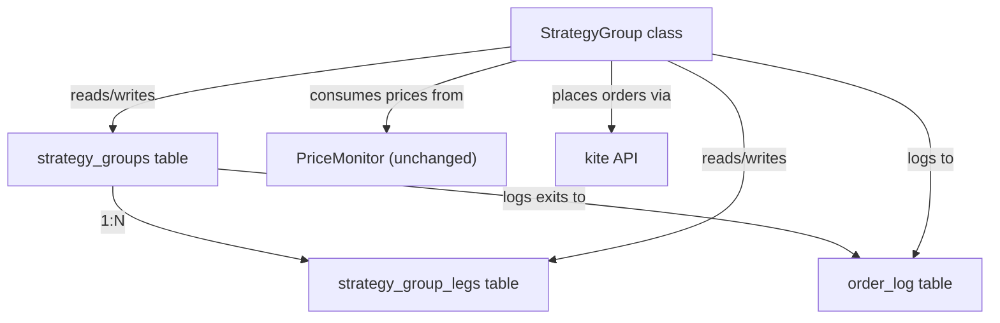

# Walkthrough: Position Grouping Module

## What was built

[strategy_group.py](file:///c:/Users/sathy/OneDrive/Desktop/Project%20Algoarms/pykite/deploy/strategy_group.py) — a standalone module for composite multi-leg strategy management.

## Architecture



## Three new DB tables

| Table | Purpose |
|---|---|
| `strategy_groups` | One row per composite strategy (name, trigger_mode, trailing %, HWM, SL) |
| `strategy_group_legs` | Legs belonging to each group (symbol, qty, txn_type, entry_price) |
| `order_log` | Audit trail of **every** order placed — individual TSL, group exits, manual |

## Key API

```python
from strategy_group import (
    init_db, create_group, add_leg, remove_leg,
    StrategyGroup, load_active_groups,
    log_order, print_order_log
)
```

### Creating a Synthetic Put

```python
group_id = create_group(db,
    name="GOLDM Synthetic Put",
    trigger_mode="underlying",
    trailing_percent=3.0,
    ref_symbol="GOLDM26APRFUT", ref_exchange="MCX",
    legs=[
        {"symbol": "GOLDM26APRFUT", "exchange": "MCX",
         "quantity": 1, "transaction_type": "BUY", "entry_price": 142177},
        {"symbol": "GOLDM26MAR142000CE", "exchange": "MCX",
         "quantity": 1, "transaction_type": "SELL", "entry_price": 537.5},
    ]
)
```

### Creating a Short Straddle

```python
group_id = create_group(db,
    name="GOLDM 142k Straddle",
    trigger_mode="combined_pnl",
    trailing_percent=5.0,
    legs=[
        {"symbol": "GOLDM26MAR142000CE", "exchange": "MCX",
         "quantity": 1, "transaction_type": "SELL", "entry_price": 537.5},
        {"symbol": "GOLDM26MAR142000PE", "exchange": "MCX",
         "quantity": 1, "transaction_type": "SELL", "entry_price": 511.0},
    ]
)
```

### Monitoring loop integration

```python
groups = load_active_groups(kite, db)
for g in groups:
    g.register_with_monitor(monitor)

# each tick:
for g in groups:
    triggered = g.update_trailing_sl(monitor)
    if triggered:
        print(f"Group {g.meta['name']} exited!")
```

## Design decisions applied

- **Exit action**: Market orders (GTT can be added later)
- **Individual TSL**: Auto-removed when a leg is added to a group (`status = 'moved_to_group'`)
- **Trigger modes**: `combined_pnl` and `underlying` only
- **Order logging**: All orders (individual + group) go through `log_order()` → `order_log` table, ready for future FastAPI frontend
